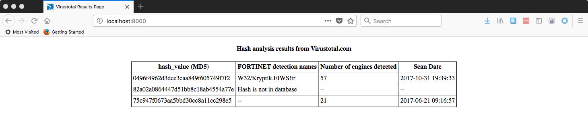

# PROJECT DESCRIPTION #
[![MIT licensed][mit-badge]][mit-link]

This Python script allows to check list of hashes (provided in a form of text file) against the virustotal.com database
using their API.

Script takes a text file as an argument, sends each hash to virustotal.com via API, runs lightweight python web server locally (on port 8000 by default) and returns the info about the hashes in the form of HTML-table with the following structure:

`hash_value (MD5)  | FORTINET detection names | Number of engines detected | Scan Date |`

Example:

The `index.html` file will be generated, holding the last query results.

NOTE:
Virustotal sets the quota - 4 API Queries per 1 minute, so the script is using 15 sec delay for each hash listed in
the file.

## Requirements ##
Script was tested on MacOS 10.11.6

## Dependencies ##
Install python with homebrew (pip will be installed automatically in this case):

    brew install python

Install virustotal-api using pip:

    pip install virustotal-api

Install HTML.py module from [here:] (https://www.decalage.info/python/html#attachments)

    curl -sSL http://www.decalage.info/files/HTML.py-0.04.zip > HTML.py-0.04.zip
    unzip HTML.py-0.04.zip
    cd HTML.py-0.04.zip
    sudo python setup.py install

## Usage ##
Running script example:

    python virustotal.py sample_hash_input.txt

To see ther results report navigate to `http://localhost:8000` in the browser.

If another port needs to be used, please run the script with --port switch:

    python virustotal.py sample_hash_input.txt --port 8080

OR:

    python virustotal.py sample_hash_input.txt -p 8080

## Other Info ##

If you find any issues with the script, please feel free to contact me at any time.

## Contacts ##
Andrew Shagayev

[mit-badge]: https://img.shields.io/badge/license-MIT-blue.svg
[mit-link]: https://raw.githubusercontent.com/drew-kun/virustotal-api-hashcheck/master/LICENSE
